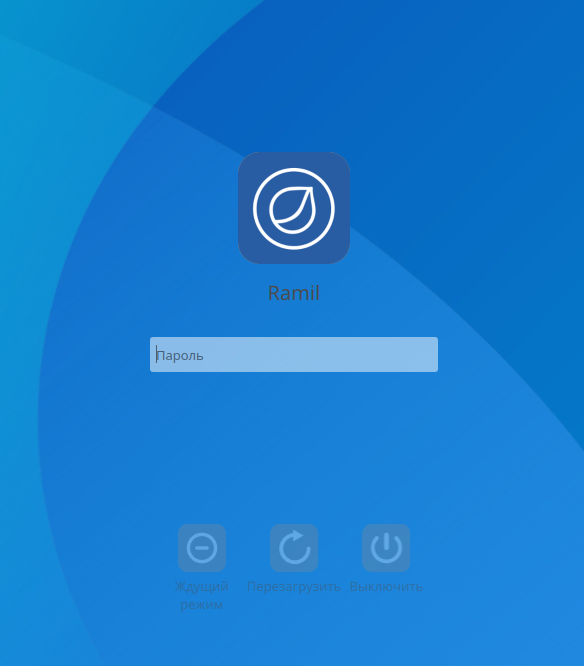

sddm-theme-neru-rosa
====================

Вход в ситему НЕРУ-РОСА. 
Основные значения настраиваются в файле theme.conf.

## Изображение (может немного отличатся от оригинала)

## Особенности

## Установка

1. Установите sddm
2. `git clone https://github.com/chistota/sddm-theme-neru-rosa.git /usr/share/sddm/themes/`
3. `chmod -R 755 /usr/share/sddm/themes/neru-rosa`

## Назначения файлов конфигурации

